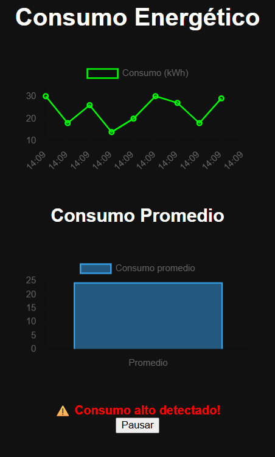

# Energy Dashboard

Dashboard web para monitoreo de consumo energético en tiempo real.

## Características

- Visualización de datos en tiempo real
- Gráfico de consumo energético
- Cálculo de promedio dinámico
- Alertas por alto consumo
- Simulación de API asincrónica
- Control de pausa/reanudación

## Tecnologías

- HTML
- CSS
- JavaScript
- Chart.js

## Cómo usar

1. Clona el repositorio:

git clone https://github.com/dropeX22/energy-dashboard.git

2. Abre `index.html` en tu navegador

Nota

Este proyecto simula datos de consumo energético como base para integración futura con APIs reales o sensores IoT.

Preview

